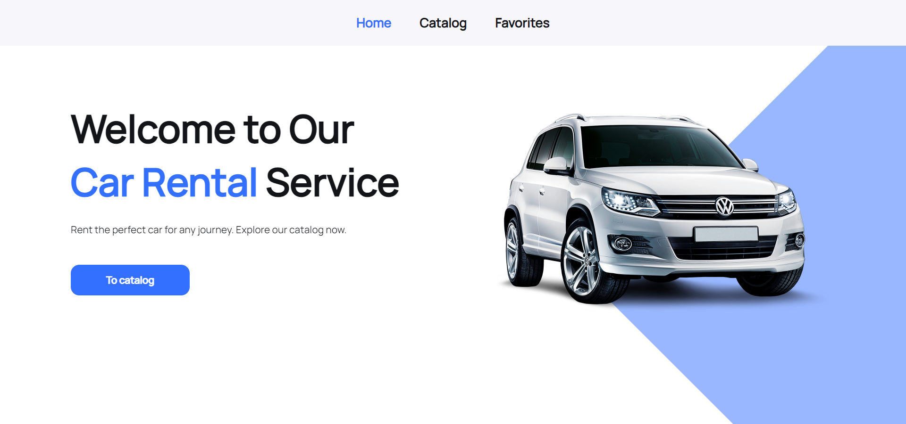

# Car Rental App

Welcome to the Car Rental App, an application developed to provide car rental
services in Ukraine. This app allows users to explore and rent a variety of
vehicles for their travel needs.

## Features

### Home Page:

- Simple and welcoming design.
- Button: "To Catalog" navigates users to the catalog page.

### Catalog Page:

- Displays a catalog of vehicles with different specifications.
- Users can filter vehicles by car brand, hourly rental price, and mileage.
- Pagination: 12 advertisements per page, with a "Load more" button.

### Favorites Page:

- Shows advertisements added to the user's favorites.
- Users can add/remove an advertisement to/from their favorites.
- Persistent state: Favorites list is maintained even after page refresh.

### Modal Window:

- Clicking "Learn more" opens a modal with detailed information about the
  selected vehicle.
- Modal closes on button click, backdrop click, or pressing the "Esc" key.
- "Rental Car" button links to the company's contact number.

### Navigation:

- Implemented using React Router with the following routes:
  - `/` - Home page
  - `/catalog` - Catalog page
  - `/favorites` - Favorites page
- Non-existent routes automatically redirect to the home page.

## Technical Specifications

- Built with React.
- State management using React Hooks and Redux.
- React Router for navigation.
- MockAPI for backend.
- Responsive design for a seamless experience on different devices.
